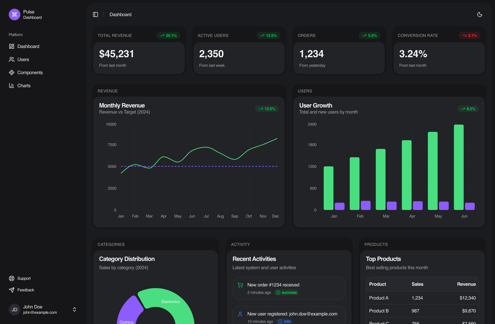

# Pulse Dashboard

A modern, comprehensive dashboard application built with Next.js, TypeScript, and Tailwind CSS. Pulse Dashboard provides a beautiful and intuitive interface for managing and monitoring business metrics.



## Features

- 🎨 **Modern UI** - Built with shadcn/ui components and Tailwind CSS
- 🔐 **Authentication** - Login and registration forms with input groups
- 📊 **Dashboard** - Comprehensive dashboard with sidebar navigation
- 🌙 **Dark Mode** - Full dark mode support
- 📱 **Responsive** - Mobile-first responsive design
- ⚡ **Fast** - Built with Next.js 16 and React 19
- 🗄️ **Database Ready** - PostgreSQL schema included for user management

## Tech Stack

- **Framework**: Next.js 16.1.4
- **Language**: TypeScript
- **Styling**: Tailwind CSS 4
- **UI Components**: shadcn/ui (Radix UI primitives)
- **Icons**: Lucide React
- **Database**: PostgreSQL (Supabase)

## Getting Started

### Prerequisites

- Node.js 18+ 
- npm, yarn, pnpm, or bun
- PostgreSQL database (or Supabase account)

### Installation

1. Clone the repository:
```bash
git clone <repository-url>
cd PulseDashboard
```

2. Install dependencies:
```bash
npm install
# or
yarn install
# or
pnpm install
```

3. Set up environment variables:
```bash
cp .env.example .env
```

4. Fill in your environment variables in `.env`:
   - Add your Supabase URL
   - Add your Supabase anon key
   - Add your Supabase service role key (if needed)

5. Set up the database:
   - Run the SQL script in `database/users.sql` on your PostgreSQL database
   - Or use Supabase SQL editor to execute the script

6. Run the development server:
```bash
npm run dev
# or
yarn dev
# or
pnpm dev
```

7. Open [http://localhost:3000](http://localhost:3000) in your browser.

## Project Structure

```
PulseDashboard/
├── src/
│   ├── app/
│   │   ├── (auth)/          # Authentication pages
│   │   │   ├── layout.tsx    # Auth layout wrapper
│   │   │   ├── login/       # Login page
│   │   │   └── register/    # Registration page
│   │   ├── dashboard/       # Dashboard pages
│   │   │   ├── layout.tsx   # Dashboard layout with sidebar
│   │   │   └── page.tsx     # Dashboard home
│   │   ├── layout.tsx       # Root layout
│   │   └── page.tsx         # Landing page
│   ├── components/
│   │   ├── auth/            # Auth form components
│   │   ├── layouts/         # Layout components
│   │   └── ui/              # shadcn/ui components
│   ├── hooks/               # Custom React hooks
│   └── lib/                 # Utility functions
├── database/
│   └── users.sql            # Database schema
├── public/                  # Static assets
└── .env.example            # Environment variables template
```

## Available Scripts

- `npm run dev` - Start development server
- `npm run build` - Build for production
- `npm run start` - Start production server
- `npm run lint` - Run ESLint

## Database Schema

The project includes a PostgreSQL schema for user management. The `users` table includes:

- `id` - Primary key
- `first_name` - User's first name
- `last_name` - User's last name
- `email` - Unique email address
- `phone_number` - Phone number
- `password_hash` - Hashed password
- `created_date` - Account creation timestamp
- `last_login_date` - Last login timestamp
- `updated_at` - Auto-updated timestamp

See `database/users.sql` for the complete schema.

## Environment Variables

Create a `.env` file in the root directory with the following variables:

```env
# Supabase Configuration
NEXT_PUBLIC_SUPABASE_URL=your_supabase_project_url
NEXT_PUBLIC_SUPABASE_ANON_KEY=your_supabase_anon_key
SUPABASE_SERVICE_ROLE_KEY=your_supabase_service_role_key
```

See `.env.example` for the template.

## Authentication

The application includes:

- **Landing Page** (`/`) - Welcome page with navigation to login/register
- **Login Page** (`/login`) - User authentication
- **Register Page** (`/register`) - New user registration

All auth pages use InputGroup components from shadcn/ui for a consistent, modern look.

## Dashboard

The dashboard (`/dashboard`) includes:

- Sidebar navigation
- Breadcrumb navigation
- Responsive layout
- Dark mode support

## Contributing

1. Fork the repository
2. Create your feature branch (`git checkout -b feature/AmazingFeature`)
3. Commit your changes (`git commit -m 'Add some AmazingFeature'`)
4. Push to the branch (`git push origin feature/AmazingFeature`)
5. Open a Pull Request

## License

This project is private and proprietary.

## Support

For support, please open an issue in the repository.
